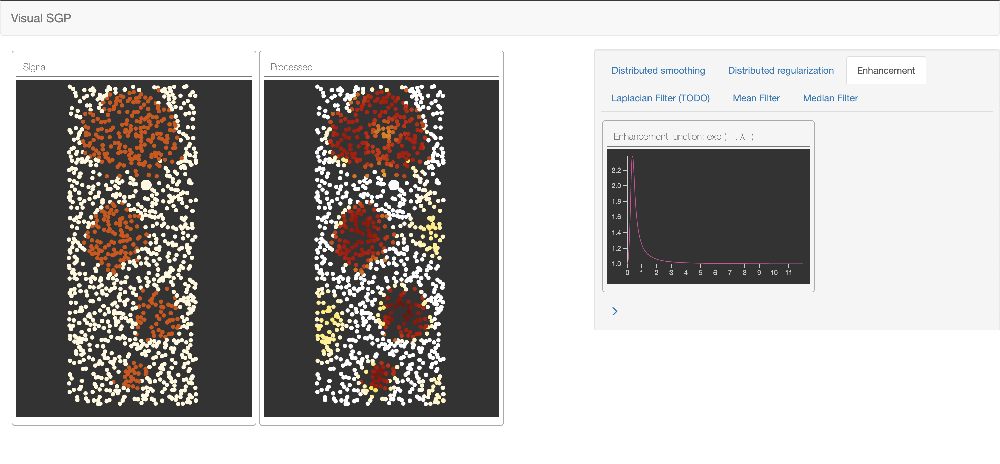

# vis-gsp
Visual Graph Signal Processing Playground

## Setup the environment

1. git clone https://github.com/paolavaldivia/vis-gsp.git
2. cd vis-gsp
3. pip install virtualenv
4. virtualenv env
5. source env/bin/activate
6. pip install -r requirements.txt

## Run the local server 

7. python run.py
8. go to [http://localhost:5000/](http://localhost:5000/)
